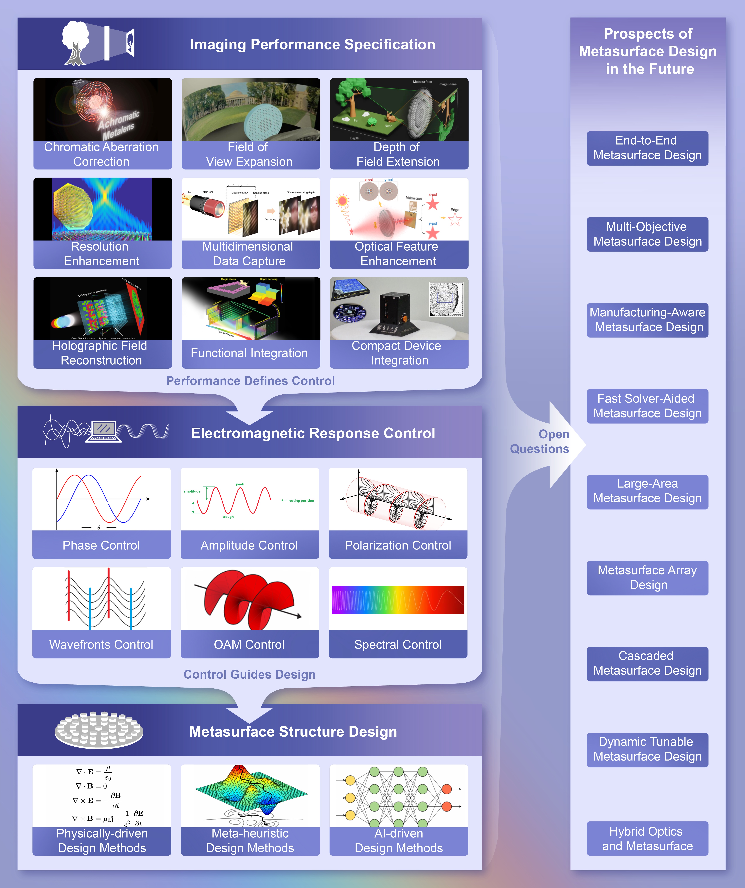
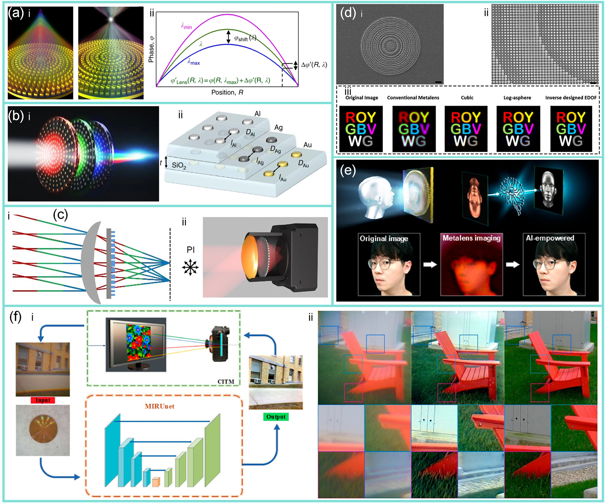
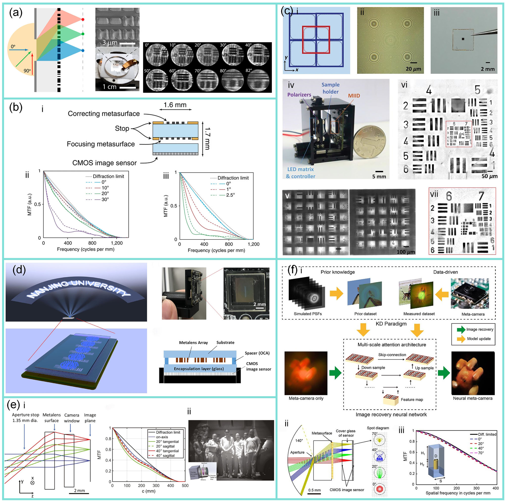
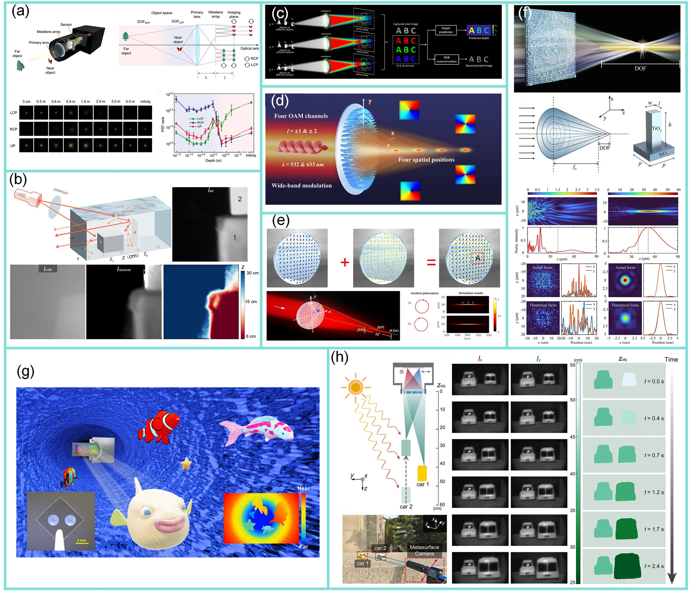
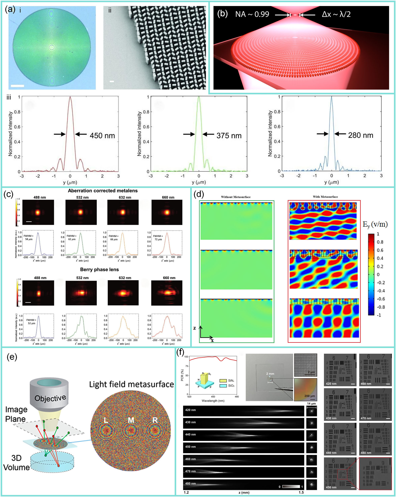
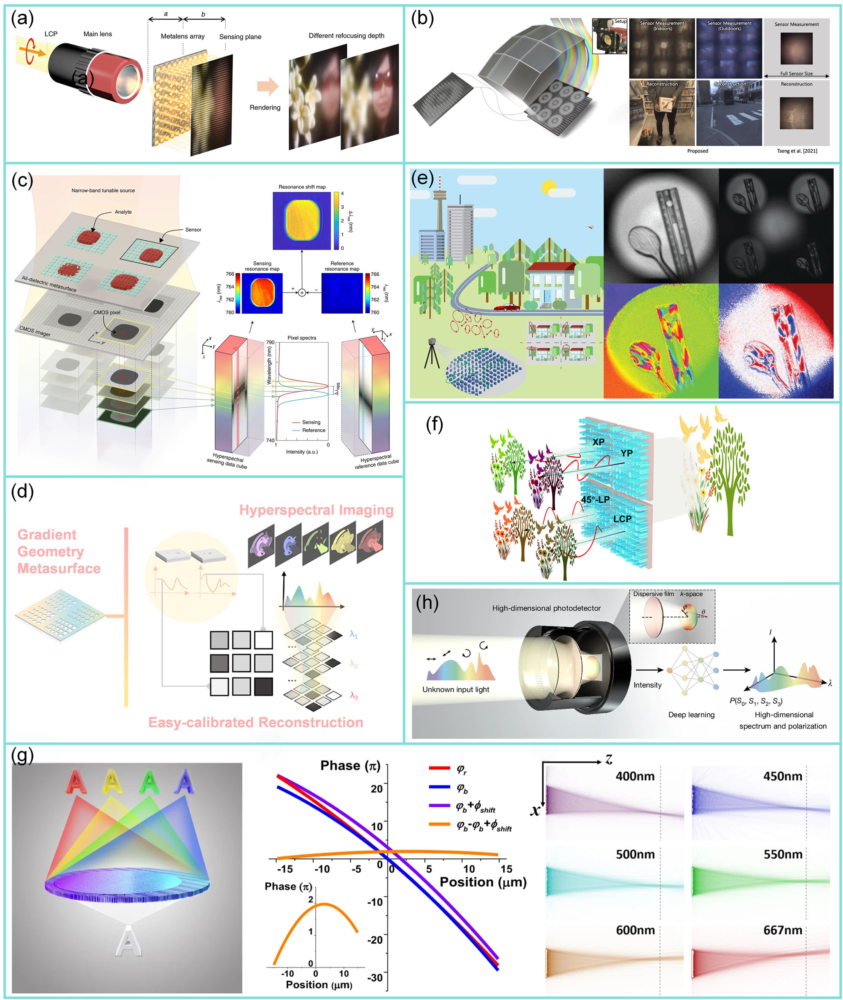
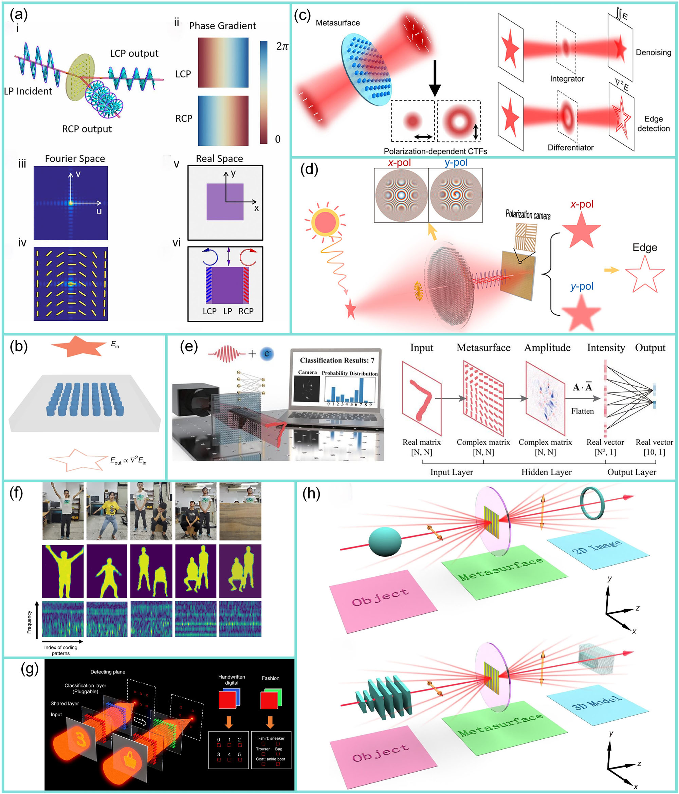
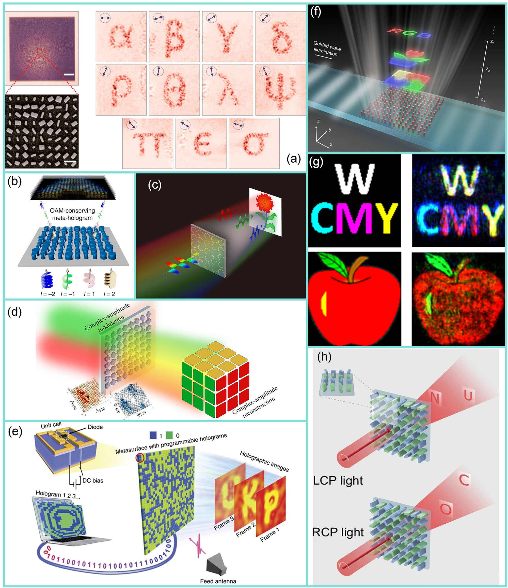
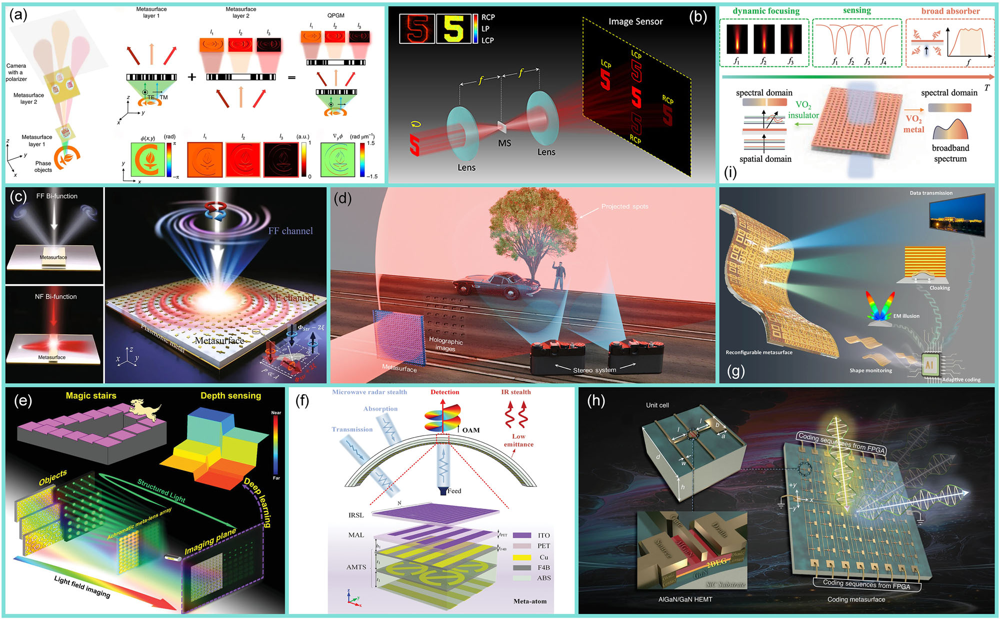
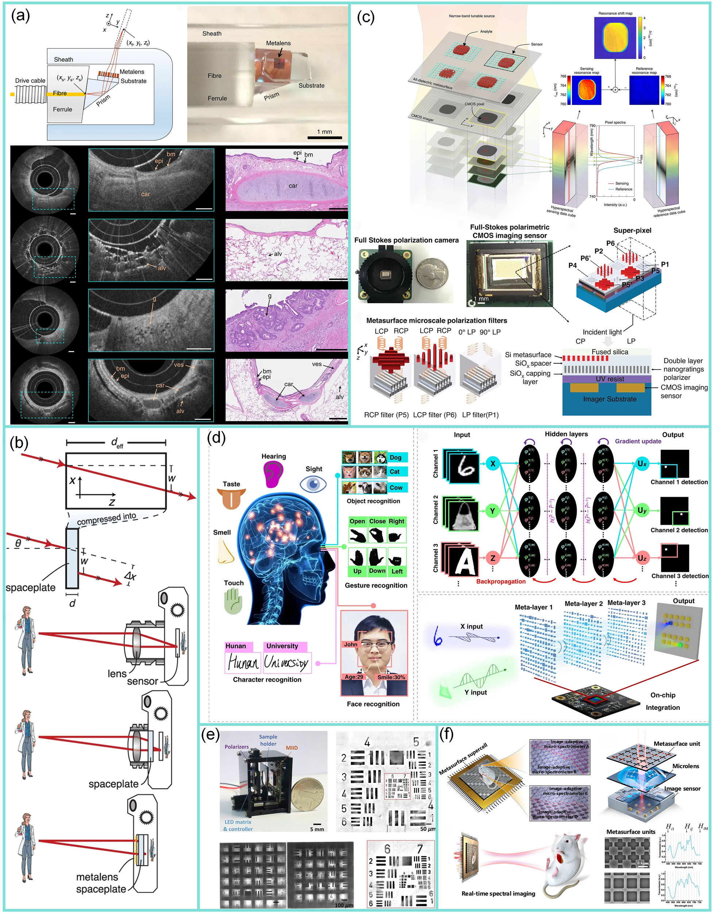

<h1 align="center">
  <strong>From Performance to Structure: A Comprehensive Survey of Advanced Metasurface Design for Next-Generation Imaging</strong>
</h1>

<h3 align="center">
  <em>npj Nanophotonics 2, 39 (2025)</em>
</h3>
<p align="center">
  <a href="https://github.com/Yunhui1998/metasurface-imaging-review">
    
  </a>
  <a href="https://www.nature.com/articles/s44310-025-00081-6">
    
  </a>
</p>

<p align="center">
  <a href="https://github.com/Yunhui1998">Yunhui Zeng</a>,
  <a href="#">Haopeng Zhong</a>,
  <a href="#">Zhenwei Long</a>,
  <a href="#">Hongkun Cao</a>,
  <a href="https://www.sigs.tsinghua.edu.cn/jx/main.htm">Xin Jin*</a>
</p>


<p align="center">
  
  
  
</p>

---



A unified "from performance to structure" framework for next-generation metasurface imaging (Figure adapted from our review).

---

## 📖 Abstract
This review introduces a ‘from performance to structure’ imaging metasurface design paradigm, which starts with essential imaging specifications and translates them into corresponding electromagnetic requirements. These requirements are then mapped onto specialized metasurface microstructures, ensuring precise electromagnetic response control. Artificial intelligence (AI) serves as a unifying thread by accelerating inverse design through efficient navigation of high-dimensional parameter spaces and by enhancing imaging performance via AI-driven computational reconstruction algorithms. We synthesize the remarkable performance of metasurfaces across six electromagnetic response control methods in nine imaging domains and categorize three main design approaches—physically-driven, meta-heuristic, and AI-driven methods—while providing a detailed analysis of six primary encoding and decoding strategies and eight common AI techniques. Additionally, nine prospective research directions are highlighted. The review emphasizes that future metasurface imaging systems will leverage electromagnetic response control to link performance with metasurface structure, with AI technology playing a central role in this process.

---

### 📂 Batch Download of References

Our **[GitHub repository](https://github.com/Yunhui1998/metasurface-imaging-review)**provides a method for **batch downloading the referenced papers**. The utility script **`Tools/download.py`** automatically parses all reference entries in the `README.md` file and downloads the corresponding PDF files (subject to network access permissions).

Detailed instructions and usage examples are available in the GitHub repository:

👉 https://github.com/Yunhui1998/metasurface-imaging-review

## 📂 Research Domains Covered

We categorize the role of metasurfaces in **nine key imaging domains**:

### 1. Chromatic Aberration Correction

  

1. Chen, J. et al. 3d-printed aberration-free terahertz metalens for ultra-broadband achromatic super-resolution wide-angle imaging with high numerical aperture. *Nat. Commun.* **16**, 363 (2025). [*(paper)*](https://doi.org/10.1038/s41467-024-55624-w)

   <table>
   <tr>
   <td width="30%">
     
   </td>
   <td width="70%">
     <p style="text-align: justify;">><b>Abstract (English):</b><br>
     Terahertz (THz) lens constitutes a vital component in the THz system. Metasurfaces-based THz metalenses and classical bulky lenses are severely constrained by chromatic/ spherical aberration and the diffraction limit. Consequently, achromatic super-resolution THz lenses are urgently needed. In this study, through translating the required phase distribution into a refractive index (RI) profile with a specific thickness, an innovative approach to designing THz metalenses is proposed and achieved by dielectric gradient metamaterials. The samples fabricated by 3D printing can realize achromatic super focusing with a numerical aperture (NA) of 0.555 from 0.2 to 0.9 THz. Submillimeter features separated by approximately 0.2 mm can be resolved with high precision, such as glass fabric patterns within FR4 panels and fibrous tissue on leaves, with a field of view (FOV) of 90°. Our approach offers a feasible and cost-effective means to implement THz super-resolution imaging, which holds great potential in non-destructive testing and biomedical imaging.</p>
     <p style="text-align: justify;">><b>摘要（中文）:</b><br>
     在太赫兹成像系统中，传统透镜往往面临色差大、像差重、体积庞大的难题。介质透镜虽然可实现聚焦，但其分辨率受限且难以在高频下保持稳定成像；超表面金属透镜虽具备紧凑结构，却常常只能在窄频段内工作，无法同时消除色差与离轴像差。如何在宽频范围内实现高分辨率、超宽视场且无像差的太赫兹聚焦，一直是该领域面临的核心挑战。针对这一问题，香港城市大学太赫兹与毫米波国家重点实验室Chi Hou Chan团队提出了一种全新的设计理念：将金属透镜中所需的相位分布转化为等效的折射率分布，并通过径向渐变的介质超材料来实现对光线传播路径的连续调控。可以将这一思路理解为“为光波绘制一条在折射率中渐变的理想轨迹”，使其像在连续变化密度的介质中一样自然弯曲、无畸变地汇聚在同一焦点。研究团队利用高精度3D打印技术制备了这种渐变折射率超构透镜，实验证实其在0.2至0.9 THz的超宽频段内可实现数值孔径为0.555的消色差超聚焦，焦斑宽度仅约为0.8倍波长，聚焦效率稳定在80%左右。在±45°的入射角下仍能保持清晰成像，视场角达到90°，并成功解析出FR4电路板内部约0.2毫米的玻纤纹理和叶片的纤维组织，展现出优异的超分辨无像差成像能力。该成果以 3D-printed aberration-free terahertz metalens for ultra-broadband achromatic super-resolution wide-angle imaging with high numerical aperture 为题，于2025年1月3日发表于《Nature Communications》。</p>
   </td>
   </tr>
   </table>

   </table>

2. You, X., Ako, R. T., Sriram, S. & Withayachumanakul, W. 3d terahertz confocal imaging with chromatic metasurface. *Laser Photonics Rev.* **19**, 2401011 (2025). [*(paper)*](https://doi.org/10.1002/lpor.202401011)

3. Liu, M. et al. Achromatic and coma-corrected hybrid meta-optics for high-performance thermal imaging. *Nano Lett.* **24**, 7609–7615 (2024). [*(paper)*](https://doi.org/10.1021/acs.nanolett.4c01218)

4. Dong, Y. et al. Achromatic single metalens imaging via deep neural network. *ACS Photonics* **11**, 1645–1656 (2024). [*(paper)*](https://doi.org/10.1021/acsphotonics.3c01870)

5. He, H. et al. Meta-attention network based spectral reconstruction with snapshot near-infrared metasurface. *Adv. Mater.* **36**, 2313357 (2024). [*(paper)*](https://doi.org/10.1002/adma.202313357)

6. Hsu, W.-L. et al. High-resolution metalens imaging with sequential artificial intelligence models. *Nano Lett.* **23**, 11614–11620 (2023). [*(paper)*](https://doi.org/10.1021/acs.nanolett.3c03416)

7. Wang, F., Zhao, S., Wen, Y., Sun, J. & Zhou, J. High efficiency visible achromatic metalens design via deep learning. *Adv. Opt. Mater.* **11**, 2300394 (2023). [*(paper)*](https://doi.org/10.1002/adom.202300394)

8. Xiao, X. et al. Large-scale achromatic flat lens by light frequency-domain coherence optimization. *Light Sci. Appl.* **11**, 323 (2022). [*(paper)*](https://doi.org/10.1038/s41377-022-01024-y)

9. Heiden, J. T. & Jang, M. S. Design framework for polarization-insensitive multifunctional achromatic metalenses. *Nanophotonics* **11**, 583–591 (2021). [*(paper)*](https://doi.org/10.1515//nanoph-2021-0638)

10. Bayati, E. et al. Inverse designed extended depth of focus meta-optics for broadband imaging in the visible. *Nanophotonics* **11**, 2531–2540 (2021). [*(paper)*](https://doi.org/10.1515/nanoph-2021-0431)

11. Wang, F. et al. Visible achromatic metalens design based on artificial neural network. *Adv. Opt. Mater.* **10**, 2101842 (2021). [*(paper)*](https://doi.org/10.1002/adom.202101842)

12. Wang, Y. et al. High-efficiency broadband achromatic metalens for near-IR biological imaging window. *Nat. Commun.* **12**, 5560 (2021). [*(paper)*](https://doi.org/10.1038/s41467-021-25797-9)

13. Ou, K. et al. Broadband achromatic metalens in mid-wavelength infrared. *Laser Photon. Rev.* **15**, 2100020 (2021). [*(paper)*](https://doi.org/10.1002/lpor.202100020)

14. Zang, W. et al. Chromatic dispersion manipulation based on metalenses. *Adv. Mater.* **32**, 1904935 (2020). [*(paper)*](https://doi.org/10.1002/adma.201904935)

15. McClung, A., Mansouree, M. & Arbabi, A. At-will chromatic dispersion by prescribing light trajectories with cascaded metasurfaces. *Light Sci. Appl.* **9**, 93 (2020). [*(paper)*](https://doi.org/10.1038/s41377-020-0335-7)

16. Ndao, A. et al. Octave bandwidth photonic fishnet-achromatic-metalens. *Nat. Commun.* **11**, 3205 (2020). [*(paper)*](https://doi.org/10.1038/s41467-020-17015-9)

17. Huang, L., Whitehead, J., Colburn, S. & Majumdar, A. Design and analysis of extended depth of focus metalenses for achromatic computational imaging. *Photonics Res.* **8**, 1613–1623 (2020). [*(paper)*](https://doi.org/10.1364/PRJ.396839)

18. Presutti, F. & Monticone, F. Focusing on bandwidth: achromatic metalens limits. *Optica* **7**, 624–631 (2020). [*(paper)*](https://doi.org/10.1364/OPTICA.389404)

19. Zhang, C. et al. Low-loss metasurface optics down to the deep ultraviolet region. *Light Sci. Appl.* **9**, 55 (2020). [*(paper)*](https://doi.org/10.1038/s41377-020-0287-y)

20. Chen, W. T., Zhu, A. Y., Sisler, J., Bharwani, Z. & Capasso, F. A broadband achromatic polarization-insensitive metalens consisting of anisotropic nanostructures. *Nat. Commun.* **10**, 355 (2019). [*(paper)*](https://doi.org/10.1038/s41467-019-08305-y)

21. Chen, W. T. et al. A broadband achromatic metalens for focusing and imaging in the visible. *Nat. Nanotechnol.* **13**, 220–226 (2018). [*(paper)*](https://doi.org/10.1038/s41565-017-0034-6)

22. Wang, S. et al. Broadband achromatic optical metasurface devices. *Nat. Commun.* **8**, 187 (2017). [*(paper)*](https://doi.org/10.1038/s41467-017-00166-7)

23. Khorasaninejad, M. et al. Achromatic metalens over 60 nm bandwidth in the visible and metalens with reverse chromatic dispersion. *Nano Lett.* **17**, 1819–1824 (2017). [*(paper)*](https://doi.org/10.1021/acs.nanolett.6b05137)

24. Avayu, O., Almeida, E., Prior, Y. & Ellenbogen, T. Composite functional metasurfaces for multispectral achromatic optics. *Nat. Commun.* **8**, 14992 (2017). [*(paper)*](https://doi.org/10.1038/ncomms14992)

25. Khorasaninejad, M. et al. Achromatic metasurface lens at telecommunication wavelengths. *Nano Lett.* **15**, 5358–5362 (2015). [*(paper)*](https://doi.org/10.1021/acs.nanolett.5b01727)

26. Akselrod, G. M. et al. Large-area metasurface perfect absorbers from visible to near-infrared. *Adv. Mater.* **27**, 8028–8024 (2015). [*(paper)*](https://doi.org/10.1002/adma.201503281)

27. Aieta, F. et al. Aberration-free ultrathin flat lenses and axicons at telecom wavelengths based on plasmonic metasurfaces. *Nano Lett.* **12**, 4932–4936 (2012). [*(paper)*](https://doi.org/10.1021/nl302516v)

---

### 2. Field of View Expansion

  

1.  Wirth-Singh, A. et al. Wide field of view large aperture meta-doublet eyepiece. *Light Sci. Appl.* **14**, 17 (2025). [*(paper)*](https://doi.org/10.1038/s41377-024-01674-0)
2.  Liu, Y. et al. Ultra-wide for meta-camera with transformer-neural-network color imaging methodology. *Adv. Photonics* **6**, 056001 (2024). [*(paper)*](https://doi.org/10.1117/1.AP.6.5.056001)
3.  Wang, Y. et al. Compact meta-optics infrared camera based on a polarization-insensitive metalens with a large field of view. *Opt. Lett.* **48**, 4709–4712 (2023). [*(paper)*](https://doi.org/10.1364/OL.499942)
4.  Liu, J., Chu, J., Zhang, R., Liu, R. & Fu, J. Wide field of view and full strokes polarization imaging using metasurfaces inspired by the stomatopod eye. *Nanophotonics* **12**, 1137–1146 (2023). [*(paper)*](https://doi.org/10.1515/nanoph-2022-0712)
5.  Chen, J. et al. Planar wide-angle-imaging camera enabled by metalens array. *Optica* **9**, 431–437 (2022). [*(paper)*](https://doi.org/10.1364/OPTICA.446063)
6.  Li, S. & Hsu, C. W. Thickness bound for nonlocal wide-field-of-view metalenses. *Light Sci. Appl.* **11**, 338 (2022). [*(paper)*](https://doi.org/10.1038/s41377-022-01038-6)
7.  Lassalle, E. et al. Imaging properties of large field-of-view quadratic metalenses and their applications to fingerprint detection. *Acs Photonics* **8**, 1457–1468 (2021). [*(paper)*](https://doi.org/10.1021/acsphotonics.1c00237)
8.  Shalaginov, M. Y. et al. Single-element diffraction-limited fisheye metalens. *Nano Lett.* **20**, 7429–7437 (2020). [*(paper)*](https://doi.org/10.1021/acs.nanolett.0c02783)
9.  Hao, C. et al. Single-layer aberration-compensated flat lens for robust wide-angle imaging. *Laser Photonics Rev.* **14**, 2000017 (2020). [*(paper)*](https://doi.org/10.1002/lpor.202000017)
10.  Martins, A. et al. On metalenses with arbitrarily wide field of view. *Acs Photonics* **7**, 2073–2079 (2020). [*(paper)*](https://doi.org/10.1021/acsphotonics.0c00479)
11.  Xu, B. et al. Metalens-integrated compact imaging devices for wide-field microscopy. *Adv. Photonics* **2**, 066004 (2020). [*(paper)*](https://doi.org/10.1117/1.AP.2.6.066004)
12.  Engelberg, J. et al. Near-IR wide-field-of-view huygens metalens for outdoor imaging applications. *Nanophotonics* **9**, 361–370 (2020). [*(paper)*](https://doi.org/10.1515/nanoph-2019-0177)
13.  Fan, C.-Y., Lin, C.-P. & Su, G.-D. J. Ultrawide-angle and high-efficiency metalens in hexagonal arrangement. *Sci. Rep.* **10**, 15677 (2020). [*(paper)*](https://doi.org/10.1038/s41598-020-72668-2)
14.  Groever, B., Chen, W. T. & Capasso, F. Meta-lens doublet in the visible region. *Nano Lett.* **17**, 4902–4907 (2017). [*(paper)*](https://doi.org/10.1021/acs.nanolett.7b01888)
15.  Arbabi, A. et al. Miniature optical planar camera based on a wide-angle metasurface doublet corrected for monochromatic aberrations. *Nat. Commun.* **7**, 13682 (2016). [*(paper)*](https://doi.org/10.1038/ncomms13682)

---

### 3. Depth of Field Extension

  

1.  Ansari, M. A. et al. Multifaceted control of focal points along an arbitrary 3d curved trajectory. *Light Sci. Appl.* **13**, 224 (2024). [*(paper)*](https://doi.org/10.1038/s41377-024-01565-4)
2.  Liu, X. et al. Underwater binocular meta-lens. *ACS Photonics* **10**, 2382–2389 (2023). [*(paper)*](https://doi.org/10.1021/acsphotonics.2c01667)
3.  Yin, B. & Wang, S. Research and design of a metasurface with an extended depth of focus in the near field. *Appl. Opt.* **62**, 7621–7627 (2023). [*(paper)*](https://doi.org/10.1364/AO.500686)
4.  Zhao, J. et al. Rapid cellular-resolution skin imaging with optical coherence tomography using all-glass multifocal metasurfaces. *ACS nano* **17**, 3442–3451 (2023). [*(paper)*](https://doi.org/10.1021/acsnano.2c09542)
5.  Shen, Z. et al. Monocular metasurface camera for passive single-shot 4d imaging. *Nat. Commun.* **14**, 1035 (2023). [*(paper)*](https://doi.org/10.1038/s41467-023-36812-6)
6.  Zheng, Y. et al. Designing high-efficiency extended depth-of-focus metalens via topology-shape optimization. *Nanophotonics* **11**, 2967–2975 (2022). [*(paper)*](https://doi.org/10.1515/nanoph-2022-0183)
7.  Zheng, R. et al. Active multiband varifocal metalens based on orbital angular momentum division multiplexing. *Nat. Commun.* **13**, 4292 (2022). [*(paper)*](https://doi.org/10.1038/s41467-022-32044-2)
8.  Fan, Q. et al. Triholite-inspired neural nanophotonic light-field camera with extreme depth-of-field. *Nat. Commun.* **13**, 2130 (2022). [*(paper)*](https://doi.org/10.1038/s41467-022-29568-y)
9.  Zhao, F. et al. Metalens-assisted system for underwater imaging. *Laser Photonics Rev.* **15**, 2100097 (2021). [*(paper)*](https://doi.org/10.1002/lpor.202100097)
10.  Tan, S., Yang, F., Boominathan, V., Veeraraghavan, A. & Naik, G. V. 3d imaging using extreme dispersion in optical metasurfaces. *ACS Photonics* **8**, 1421–1429 (2021). [*(paper)*](https://doi.org/10.1021/acsphotonics.1c00110)
11.  Bayati, E. et al. Inverse designed metalenses with extended depth of focus. *ACS Photonics* **7**, 873–878 (2020). [*(paper)*](https://doi.org/10.1021/acsphotonics.9b01703)
12.  Zhang, Z., Yang, Q., Gong, M., Chen, M. & Long, Z. Metasurface lens with angular modulation for extended depth of focus imaging. *Opt. Lett.* **45**, 611–614 (2020). [*(paper)*](https://doi.org/10.1364/OL.382812)
13.  Colburn, S. & Majumdar, A. Single-shot three-dimensional imaging with a metasurface depth camera. *arXiv preprint arXiv:1910.12111* (2019). [*(paper)*](https://arxiv.org/abs/1910.12111)

---

### 4. Resolution Enhancement

  

1.  Basak, S. et al. Super-resolution optical fluctuation imaging. *Nat. Photonics* **19**, 229–237 (2025). [*(paper)*](https://doi.org/10.1038/s41566-024-01571-3)
2.  Zhou, Q. et al. Far-field phase-shifting structured light illumination enabled by polarization multiplexing metasurface for super-resolution imaging. *Nano Lett.* **24**, 11036–11042 (2024). [*(paper)*](https://doi.org/10.1021/acs.nanolett.4c03142)
3.  Wang, J. et al. Quantitative phase imaging with a compact metamicroscope. *npj Nanophotonics* **1**, 4 (2024). [*(paper)*](https://doi.org/10.1038/s44310-024-00007-8)
4.  Li, W., Qi, J. & Mu, A. Single-pixel super-resolution with a space-time modulated computational metasurface imager. *Photonics Res.* **12**, 2311–2322 (2024). [*(paper)*](https://doi.org/10.1364/PRJ.532222)
5.  Akbari-Chelaresi, H., Salami, P. & Yousefi, L. Far-field sub-wavelength imaging using high-order dielectric continuous metasurfaces. *Opt. Express* **30**, 39025–39039 (2022). [*(paper)*](https://doi.org/10.1364/OE.470221)
6.  Ye, X. et al. Chip-scale metalens microscope for wide-field and depth-of-field imaging. *Adv. Photonics* **4**, 046006 (2022). [*(paper)*](https://doi.org/10.1117/1.AP.4.4.046006)
7.  Sawant, R. et al. Aberration-corrected large-scale hybrid metalenses. *Optica* **8**, 1405–1411 (2021). [*(paper)*](https://doi.org/10.1364/OPTICA.434040)
8.  Hampson, K. M. et al. Adaptive optics for high-resolution imaging. *Nat. Rev. Methods Prim.* **1**, 68 (2021). [*(paper)*](https://doi.org/10.1038/s43586-021-00066-7)
9.  Hajahmadi, M. J., Faraji-Dana, R. & Skrivenvik, A. K. Far field superlensing inside biological media through a nanorod lens using spatiotemporal information. *Sci. Rep.* **11**, 1953 (2021). [*(paper)*](https://doi.org/10.1038/s41598-021-81091-0)
10.  Chen, M.-H., Chou, W.-N., Su, V.-C., Kuan, C.-H. & Lin, H. Y. High-performance gallium nitride dielectric metalenses for imaging in the visible. *Sci. Rep.* **11**, 6500 (2021). [*(paper)*](https://doi.org/10.1038/s41598-021-86057-w)
11.  Conteduca, D. et al. Dielectric nanohole array metasurface for high-resolution near-field sensing and imaging. *Nat. Commun.* **12**, 3293 (2021). [*(paper)*](https://doi.org/10.1038/s41467-021-23357-9)
12.  Zhu, A. Y. et al. Compact aberration-corrected spectrometers in the visible using dispersion-tailored metasurfaces. *Adv. Opt. Mater.* **7**, 1801144 (2019). [*(paper)*](https://doi.org/10.1002/adom.201801144)
13.  Holsteen, A. L., Lin, D., Kauvar, I., Wetzstein, G. & Brongersma, M. L. A light-field metasurface for high-resolution single-particle tracking. *Nano Lett.* **19**, 2267–2271 (2019). [*(paper)*](https://doi.org/10.1021/acs.nanolett.8b04673)
14.  Hall, C. U., Poulikakos, D. & Eghlidi, H. High-efficiency, extreme-numerical-aperture metasurfaces based on partial control of the phase of light. *Adv. Opt. Mater.* **6**, 1800852 (2018). [*(paper)*](https://doi.org/10.1002/adom.201800852)
15.  Paniagua-Dominguez, R. et al. A metalens with a near-unity numerical aperture. *Nano Lett.* **18**, 2124–2132 (2018). [*(paper)*](https://doi.org/10.1021/acs.nanolett.8b00368)
16.  Zuo, R., Liu, W., Cheng, H., Chen, S. & Tian, J. Breaking the diffraction limit with radially polarized light based on dielectric metalenses. *Adv. Opt. Mater.* **6**, 1800795 (2018). [*(paper)*](https://doi.org/10.1002/adom.201800795)
17.  Chen, W. T. et al. Immersion meta-lenses at visible wavelengths for nanoscale imaging. *Nano Lett.* **17**, 3188–3194 (2017). [*(paper)*](https://doi.org/10.1021/acs.nanolett.7b00717)
18.  Gao, H. et al. Super-resolution imaging with a beesel lens realized by a geometric metasurface. *Opt. Express* **25**, 13933–13943 (2017). [*(paper)*](https://doi.org/10.1364/OE.25.013933)
19.  Yang, H. et al. Reflective metalens with sub-diffraction-limited and multifunctional focusing. *Sci. Rep.* **7**, 12632 (2017). [*(paper)*](https://doi.org/10.1038/s41598-017-13004-z)
20.  Khorasaninejad, M. et al. Metalenses at visible wavelengths: diffraction-limited focusing and subwavelength resolution imaging. *Science* **352**, 1190–1194 (2016). [*(paper)*](https://doi.org/10.1126/science.aaf6644)
21.  Lu, D. & Liu, Z. Hyperlenses and metalenses for far-field super-resolution imaging. *Nat. Commun.* **3**, 1205 (2012). [*(paper)*](https://doi.org/10.1038/ncomms2176)
22.  Fang, N., Lee, H., Sun, C. & Zhang, X. Sub-diffraction-limited optical imaging with a silver superlens. *Science* **308**, 534–537 (2005). [*(paper)*](https://doi.org/10.1126/science.1108759)

---

### 5. Multidimensional Data Capture

  

1. Fu, B. et al. Miniaturized high-efficiency snapshot polarimetric stereoscopic imaging. *Optica* **12**, 391–398 (2025). [*(paper)*](https://doi.org/10.1364/OPTICA.549864)
2. Zhao, Z. et al. Hyperspectral metachip-based 3d spatial map for cancer cell screening and quantification. *Adv. Mater.* **37**, 2412738 (2025). [*(paper)*](https://doi.org/10.1002/adma.202412738)
3. Zhang, Z. et al. Single-shot on-chip diffractive speckle spectrometer with high spectral channel density. *Laser Photonics Rev.* **19**, 2401987 (2025). [*(paper)*](https://doi.org/10.1002/lpor.202401987)
4. Liu, Z. et al. Dual jones matrices empowered six phase channels modulation with single-layer monoatomic metasurfaces. *Laser Photonics Rev.* **19**, 2401526 (2025). [*(paper)*](https://doi.org/10.1002/lpor.202401526)
5. Tang, F. et al. Metasurface spectrometers beyond resolution-sensitivity constraints. *Sci. Adv.* **10**, eadr7155 (2024). [*(paper)*](https://doi.org/10.1126/sciadv.adr7155)
6. Hao, H. et al. Single-shot 3d imaging meta-microscope. *Nano Lett.* **24**, 13364–13373 (2024). [*(paper)*](https://doi.org/10.1021/acs.nanolett.4c03952)
7. Yang, J. et al. Reconfigurable snapshot hyperspectral imaging sensor based on monochromatic pattern match of gradient geometry metasurface. *ACS Photonics* **11**, 3841–3851 (2024). [*(paper)*](https://doi.org/10.1021/acsphotonics.4c01136)
8. Cai, G. et al. Compact angle-resolved metasurface spectrometer. *Nat. Mater.* **23**, 71–78 (2024). [*(paper)*](https://doi.org/10.1038/s41563-023-01710-1)
9. Zuo, J. et al. Metasurface-based mueller matrix microscope. *Adv. Funct. Mater.* **34**, 2405412 (2024). [*(paper)*](https://doi.org/10.1002/adfm.202405412)
10. Hu, Y. et al. Achromatic full stokes polarimetry metasurface for full-color polarization imaging in the visible range. *Nano Lett.* **24**, 13018–13026 (2024). [*(paper)*](https://doi.org/10.1021/acs.nanolett.4c03785)
11. Zaidi, A. et al. Metasurface-enabled single-shot and complete mueller matrix imaging. *Nat. Photonics* **18**, 704–712 (2024). [*(paper)*](https://doi.org/10.1038/s41566-024-01426-x)
12. Fan, Y. et al. Dispersion-assisted high-dimensional photodetector. *Nature* **630**, 70–83 (2024). [*(paper)*](https://doi.org/10.1038/s41586-024-07398-w)
13. Chakravarthula, P. et al. Thin on-sensor nanophotonic array cameras. *ACM Trans. Graph.* **42**, 1–18 (2023). [*(paper)*](https://doi.org/10.1145/3618398)
14. Fan, Q. et al. Disordered metasurface enabled single-shot full-Stokes polarization imaging leveraging weak dichroism. *Nat. Commun.* **14**, 7180 (2023). [*(paper)*](https://doi.org/10.1038/s41467-023-42944-6)
15. Zuo, J. et al. Chip-integrated metasurface full-Stokes polarimetric imaging sensor. *Light Sci. Appl.* **12**, 218 (2023). [*(paper)*](https://doi.org/10.1038/s41377-023-01260-w)
16. Kim, G. et al. Metasurface-driven full-space structured light for three-dimensional imaging. *Nat. Commun.* **13**, 5920 (2022). [*(paper)*](https://doi.org/10.1038/s41467-022-32117-2)
17. Jing, X. et al. Single-shot 3d imaging with point cloud projection based on metadevice. *Nat. Commun.* **13**, 7842 (2022). [*(paper)*](https://doi.org/10.1038/s41467-022-35483-z)
18. Xiong, J. et al. Dynamic brain spectrum acquired by a real-time ultraspectral imaging chip with reconfigurable metasurfaces. *Optica* **9**, 461–468 (2022). [*(paper)*](https://doi.org/10.1364/OPTICA.440013)
19. Makarenko, M. et al. Real-time hyperspectral imaging in hardware via trained metasurface encoders. In *Proc. IEEE/CVF Conference on Computer Vision and Pattern Recognition*, 12692–12702 (IEEE, 2022). [*(paper)*](https://doi.org/10.1109/CVPR52688.2022.01236)
20. Bao, Y. et al. Observation of full-parameter jones matrix in bilayer metasurface. *Nat. Commun.* **13**, 7550 (2022). [*(paper)*](https://doi.org/10.1038/s41467-022-35313-2)
21. Ren, Y. et al. Full-stokes polarimetry for visible light enabled by an all-dielectric metasurface. *Adv. Photonics Res.* **3**, 2100373 (2022). [*(paper)*](https://doi.org/10.1002/adpr.202100373)
22. Hua, X. et al. Ultra-compact snapshot spectral light-field imaging. *Nat. Commun.* **13**, 2732 (2022). [*(paper)*](https://doi.org/10.1038/s41467-022-30439-9)
23. Zhang, C. et al. High efficiency all-dielectric pixelated metasurface for near-infrared full-stokes polarization detection. *Photonics Res.* **9**, 583–589 (2021). [*(paper)*](https://doi.org/10.1364/PRJ.415342)
24. Diebold, A. V. et al. Passive microwave spectral imaging with dynamic metasurface apertures. *Optica* **7**, 527–536 (2020). [*(paper)*](https://doi.org/10.1364/OPTICA.386516)
25. McClung, A. et al. Snapshot spectral imaging with parallel metasystems. *Sci. Adv.* **6**, eabc7646 (2020). [*(paper)*](https://doi.org/10.1126/sciadv.abc7646)
26. Lin, R. J. et al. Achromatic metalens array for full-colour light-field imaging. *Nat. Nanotechnol.* **14**, 227–231 (2019). [*(paper)*](https://doi.org/10.1038/s41565-018-0347-0)
27. Faraji-Dana, M. et al. Hyperspectral imager with folded metasurface optics. *Acs Photonics* **6**, 2161–2167 (2019). [*(paper)*](https://doi.org/10.1021/acsphotonics.9b00744)
28. Yesilkov, F. et al. Ultrasensitive hyperspectral imaging and biodetection enabled by dielectric metasurfaces. *Nat. Photonics* **13**, 390–396 (2019). [*(paper)*](https://doi.org/10.1038/s41566-019-0394-6)
29. Rubin, N. A. et al. Matrix fourier optics enables a compact full-Stokes polarization camera. *Science* **365**, eaax1839 (2019). [*(paper)*](https://doi.org/10.1126/science.aax1839)
30. Arbabi, E. et al. Full-stokes imaging polarimetry using dielectric metasurfaces. *Acs Photonics* **5**, 3132–3140 (2018). [*(paper)*](https://doi.org/10.1021/acsphotonics.8b00362)
31. Stewart, J. W. et al. Toward multispectral imaging with colloidal metasurface pixels. *Adv. Mater.* **29**, 1602971 (2017). [*(paper)*](https://doi.org/10.1002/adma.201602971)

---

### 6. Optical Feature Enhancement



1. Bi, X. et al. Concurrent image differentiation and integration processings enabled by polarization-multiplexed metasurface. *Laser Photonics Rev.* **19**, 2400718 (2025). [*(paper)*](https://doi.org/10.1002/lpor.202400718)
2. Zhu, Y. et al. On-site quantitative detection of fentanyl in heroin by machine learning-enabled sensors on super absorbing metasurfaces. *npj Nanophotonics* **2**, 7 (2025). [*(paper)*](https://doi.org/10.1038/s44310-025-00055-8)
3. Swartz, B. T., Zheng, H., Forcherio, G. T. & Valentine, J. Broadband and large-aperture metasurface edge encoders for incoherent infrared radiation. *Sci. Adv.* **10**, eadk0024 (2024). [*(paper)*](https://doi.org/10.1126/sciadv.adk0024)
4. Meng, J., Balendhran, S., Sabri, Y., Bhargava, S. K. & Crozier, K. B. Smart mid-infrared metasurface microspectrometer gas sensing system. *Microsyst. Nanoeng.* **10**, 74 (2024). [*(paper)*](https://doi.org/10.1038/s41378-024-00697-2)
5. Tan, H., Meng, J. & Crozier, K. B. Multianalyte detection with metasurface-based midinfrared microspectrometer. *ACS Sens.* **9**, 5839–5847 (2024). [*(paper)*](https://doi.org/10.1021/acssensors.4c01220)
6. He, C. et al. Pluggable multitask diffractive neural networks based on cascaded metasurfaces. *Opto-Electron. Adv.* **7**, 230005 (2024). [*(paper)*](https://doi.org/10.29026/oea.2024.230005)
7. Tanriover, I., Dereshgi, S. A. & Aydin, K. Metasurface enabled broadband all optical edge detection in visible frequencies. *Nat. Commun.* **14**, 6484 (2023). [*(paper)*](https://doi.org/10.1038/s41467-023-42271-w)
8. Wang, S. et al. Metalens for accelerated optoelectronic edge detection under ambient illumination. *Nano Lett.* **24**, 356–361 (2023). [*(paper)*](https://doi.org/10.1021/acs.nanolett.3c04112)
9. Xu, D. et al. All-optical object identification and three-dimensional reconstruction based on optical computing metasurface. *Opto-Electron. Adv.* **6**, 230120 (2023). [*(paper)*](https://doi.org/10.29026/oea.2023.230120)
10. Yang, S. et al. Realizing depth measurement and edge detection based on a single metasurface. *Nanophotonics* **12**, 3385–3393 (2023). [*(paper)*](https://doi.org/10.1515/nanoph-2023-0308)
11. Qu, G. et al. All-dielectric metasurface empowered optical-electronic hybrid neural networks. *Laser Photonics Rev.* **16**, 2100732 (2022). [*(paper)*](https://doi.org/10.1002/lpor.202100732)
12. Wang, H. P. et al. Noncontact electromagnetic wireless recognition for prosthesis based on intelligent metasurface. *Adv. Sci.* **9**, 2105056 (2022). [*(paper)*](https://doi.org/10.1002/advs.202105056)
13. Zhou, Y., Zheng, H., Kravchenko, I. I. & Valentine, J. Flat optics for image differentiation. *Nat. Photonics* **14**, 316–323 (2020). [*(paper)*](https://doi.org/10.1038/s41566-020-0591-3)
14. Weng, J. et al. Meta-neural-network for real-time and passive deep-learning-based object recognition. *Nat. Commun.* **11**, 6309 (2020). [*(paper)*](https://doi.org/10.1038/s41467-020-19693-x)
15. Zhou, J. et al. Optical edge detection based on high-efficiency dielectric metasurface. *Proc. Natl. Acad. Sci. USA* **116**, 11137–11140 (2019). [*(paper)*](https://doi.org/10.1073/pnas.1820636116)
16. Li, L. et al. Intelligent metasurface imager and recognizer. *Light Sci. Appl.* **8**, 97 (2019). [*(paper)*](https://doi.org/10.1038/s41377-019-0209-z)
17. Li, L. et al. Machine-learning reprogrammable metasurface imager. *Nat. Commun.* **10**, 1082 (2019). [*(paper)*](https://doi.org/10.1038/s41467-019-09103-2)
18. Miyazaki, H. et al. Dual-band infrared metasurface thermal emitter for CO2 sensing. *Appl. Phys. Lett.* **105**, 121107 (2014). [*(paper)*](https://doi.org/10.1063/1.4896545)

---

### 7. Holographic Field Reconstruction



1. Aththanayake, A. et al. Tunable holographic metasurfaces for augmented and virtual reality. *Nanophotonics* (2025). [*(paper)*](https://doi.org/10.1515/nanoph-2024-0734)
2. Jue, J. et al. Three-photon direct laser writing of the qd-polymer metasurface for large field-of-view optical holography. *ACS Appl. Mater. Interfaces* **17**, 14520–14526 (2025). [*(paper)*](https://doi.org/10.1021/acsami.4c21233)
3. Meng, W. et al. Ultranarrow-linewidth wavelength-vortex metasurface holography. *Sci. Adv.* **11**, eadl9159 (2025). [*(paper)*](https://doi.org/10.1126/sciadv.adt9159)
4. Yin, Y. et al. Color holographic display based on complex-amplitude metasurface. *Laser Photonics Rev.* **19**, 2400884 (2025). [*(paper)*](https://doi.org/10.1002/lpor.202400884)
5. Sun, J. & Li, T. Cascaded metalenses boost applications in near-eye display. *Light Sci. Appl.* **14**, 58 (2025). [*(paper)*](https://doi.org/10.1038/s41377-024-01699-5)
6. Rao, R., Shi, Y., Wang, Z., Wan, S. & Li, Z. On-chip cascaded metasurfaces for visible wavelength division multiplexing and color-routing meta-display. *Nano Lett.* **25**, 2452–2458 (2025). [*(paper)*](https://doi.org/10.1021/acs.nanolett.4c05946)
7. Gopakumar, M. et al. Full-colour 3d holographic augmented-reality displays with metasurface waveguides. *Nature* **629**, 791–797 (2024). [*(paper)*](https://doi.org/10.1038/s41586-024-07386-0)
8. Sun, S. et al. High-efficiency, broadband, and low-crosstalk 3d holography by multi-layer holographic-lens integrated metasurface. *APL Photonics* **9**, 086102 (2024). [*(paper)*](https://doi.org/10.1063/5.0218862)
9. Yin, Y. et al. Multi-dimensional multiplexed metasurface holography by inverse design. *Adv. Mater.* **36**, 2312303 (2024). [*(paper)*](https://doi.org/10.1002/adma.202312303)
10. Wang, D. et al. Decimeter-depth and polarization addressable color 3d meta-holography. *Nat. Commun.* **15**, 8242 (2024). [*(paper)*](https://doi.org/10.1038/s41467-024-52267-9)
11. Zhang, J. C. et al. Programmable optical meta-holograms. *Nanophotonics* **13**, 1201–1217 (2024). [*(paper)*](https://doi.org/10.1515/nanoph-2023-0544)
12. Li, Z., Shi, Y., Dai, C. & Li, Z. On-chip-driven multicolor 3d meta-display. *Laser Photonics Rev.* **18**, 2301240 (2024). [*(paper)*](https://doi.org/10.1002/lpor.202301240)
13. Fan, Z.-B. et al. Integral imaging near-eye 3d display using a nanoimprint metalens array. *eLight* **4**, 3 (2024). [*(paper)*](https://doi.org/10.1186/s43593-023-00055-1)
14. Liu, Z. et al. Metasurface-enabled augmented reality display: a review. *Adv. Photonics* **5**, 034001 (2023). [*(paper)*](https://doi.org/10.1117/1.AP.5.3.034001)
15. Li, Z. et al. Inverse design enables large-scale high-performance meta-optics reshaping virtual reality. *Nat. Commun.* **13**, 2409 (2022). [*(paper)*](https://doi.org/10.1038/s41467-022-29973-3)
16. Li, Y. et al. Ultracompact multifunctional metalens visor for augmented reality displays. *PhotonIX* **3**, 29 (2022). [*(paper)*](https://doi.org/10.1186/s43074-022-00075-z)
17. Kim, J. et al. Tunable metasurfaces towards versatile metalenses and metabolograms: a review. *Adv. Photonics* **4**, 024001 (2022). [*(paper)*](https://doi.org/10.1117/1.AP.4.2.024001)
18. Boo, H. et al. Metasurface wavefront control for high-performance user-natural augmented reality waveguide glasses. *Sci. Rep.* **12**, 5832 (2022). [*(paper)*](https://doi.org/10.1038/s41598-022-09680-1)
19. Li, Z. et al. Meta-optics achieves rgb-achromatic focusing for virtual reality. *Sci. Adv.* **7**, eabe4458 (2021). [*(paper)*](https://doi.org/10.1126/sciadv.abe4458)
20. Xiong, J., Hsiang, E.-L., He, Z., Zhan, T. & Wu, S.-T. Augmented reality and virtual reality displays: emerging technologies and future perspectives. *Light Sci. Appl.* **10**, 216 (2021). [*(paper)*](https://doi.org/10.1038/s41377-021-00658-8)
21. Georgi, P. et al. Optical secret sharing with cascaded metasurface holography. *Sci. Adv.* **7**, eabf9718 (2021). [*(paper)*](https://doi.org/10.1126/sciadv.abf9718)
22. Kim, I. et al. Pixelated bifunctional metasurface-driven dynamic vectorial holographic color prints for photonic security platform. *Nat. Commun.* **12**, 3614 (2021). [*(paper)*](https://doi.org/10.1038/s41467-021-23814-5)
23. Kim, J. et al. Geometric and physical configurations of meta-atoms for advanced metasurface holography. *InfoMat* **3**, 739–754 (2021). [*(paper)*](https://doi.org/10.1002/inf2.12191)
24. Xiong, B. et al. Realizing colorful holographic mimicry by metasurfaces. *Adv. Mater.* **33**, 2005864 (2021). [*(paper)*](https://doi.org/10.1002/adma.202005864)
25. Mu, Y., Zheng, M., Qi, J., Li, H. & Qiu, J. A large field-of-view metasurface for complex-amplitude hologram breaking numerical aperture limitation. *Nanophotonics* **9**, 4749–4759 (2020). [*(paper)*](https://doi.org/10.1515/nanoph-2020-0448)
26. Deng, Z.-L. et al. Full-color complex-amplitude vectorial holograms based on multi-freedom metasurfaces. *Adv. Funct. Mater.* **30**, 1910610 (2020). [*(paper)*](https://doi.org/10.1002/adfm.201910610)
27. Qu, G. et al. Reprogrammable meta-hologram for optical encryption. *Nat. Commun.* **11**, 5484 (2020). [*(paper)*](https://doi.org/10.1038/s41467-020-19312-9)
28. Jiang, Q., Jin, G. & Cao, L. When metasurface meets hologram: principle and advances. *Adv. Opt. Photonics* **11**, 518–576 (2019). [*(paper)*](https://doi.org/10.1364/AOP.11.000518)
29. Ren, H. et al. Metasurface orbital angular momentum holography. *Nat. Commun.* **10**, 2986 (2019). [*(paper)*](https://doi.org/10.1038/s41467-019-11030-1)
30. Hu, Y. et al. 3d-integrated metasurfaces for full-colour holography. *Light Sci. Appl.* **8**, 86 (2019). [*(paper)*](https://doi.org/10.1038/s41377-019-0198-y)
31. Lee, G.-Y. et al. Metasurface eyepiece for augmented reality. *Nat. Commun.* **9**, 4562 (2018). [*(paper)*](https://doi.org/10.1038/s41467-018-07011-5)
32. Li, J. et al. Addressing metasurfaces for dynamic holography and optical information encryption. *Sci. Adv.* **4**, eaaq6768 (2018). [*(paper)*](https://doi.org/10.1126/sciadv.aar6768)
33. Deng, Z.-L. & Li, G. Metasurface optical holography. *Mater. Today Phys.* **3**, 16–32 (2017). [*(paper)*](https://doi.org/10.1016/j.mtphys.2017.11.001)
34. Li, L. et al. Electromagnetic reprogrammable coding-metasurface holograms. *Nat. Commun.* **8**, 197 (2017). [*(paper)*](https://doi.org/10.1038/s41467-017-00164-9)
35. Wan, W., Gao, J. & Yang, X. Full-color plasmonic metasurface holograms. *ACS Nano* **10**, 10671–10680 (2016). [*(paper)*](https://doi.org/10.1021/acsnano.6b05453)
36. Wang, B. et al. Wavelength de-multiplexing metasurface hologram. *Sci. Rep.* **6**, 35657 (2016). [*(paper)*](https://doi.org/10.1038/srep35657)

---

### 8. Functional Integration



1. Li, F. et al. Flexible intelligent microwave metasurface with shape-guided adaptive programming. *Nat. Commun.* **16**, 3161 (2025). [*(paper)*](https://doi.org/10.1038/s41467-025-58249-9)
2. Yang, G. et al. Nonlocal phase-change meta-optics for reconfigurable nonvolatile image processing. *Light Sci. Appl.* **14**, 1–10 (2025). [*(paper)*](https://doi.org/10.1038/s41377-025-01841-x)
3. Xing, Z. et al. Monolithic spin-multiplexing metalens for dual-functional imaging. *Laser Photonics Rev.* **19**, 2401993 (2025). [*(paper)*](https://doi.org/10.1002/lpor.202401993)
4. Sulejman, S. B. et al. Metasurfaces for infrared multimodal microscopy: phase contrast and bright field. *ACS Photonics* **12**, 1494–1506 (2025). [*(paper)*](https://doi.org/10.1021/acsphotonics.4c02097)
5. Li, N., Zhang, J., Neshev, D. N. & Sukhorukov, A. A. Angle multifunctional dichroism in metasurfaces. *ACS Photonics* **12**, 1441–1447 (2025). [*(paper)*](https://doi.org/10.1021/acsphotonics.4c01999)
6. Zhou, Y. et al. Flexible metasurfaces for multifunctional interfaces. *ACS Nano* **18**, 2685–2707 (2024). [*(paper)*](https://doi.org/10.1021/acsnano.3c09310)
7. Guo, S. et al. Multifunctional metasurface: Holography and spot cloud projection. *Adv. Opt. Mater.* **12**, 2401235 (2024). [*(paper)*](https://doi.org/10.1002/adom.202401235)
8. Wang, Y. et al. Detection and anti-detection with microwave-infrared compatible camouflage using asymmetric composite metasurface. *Adv. Sci.* **11**, 2410364 (2024). [*(paper)*](https://doi.org/10.1002/advs.202410364)
9. Armghan, A. et al. A high-performance ultra-wideband metasurface absorber and thermal emitter for solar energy harvesting and thermal applications. *Phys. Chem. Chem. Phys.* **26**, 25469–25479 (2024). [*(paper)*](https://doi.org/10.1039/D4CP03336A)
10. Zhang, Z. et al. Multifunctional ultrathin metasurface with a low radar cross section and variable infrared emissivity. *ACS Appl. Mater. Interfaces* **16**, 21109–21117 (2024). [*(paper)*](https://doi.org/10.1021/acsami.4c01798)
11. Yang, X., Wen, E., Bharadia, D. & Sievenpiper, D. F. Multifunctional metasurface: simultaneous beam steering, polarization conversion and phase offset. *IEEE Trans. Antennas Propag.* **72**, 4589–4593 (2024). [*(paper)*](https://doi.org/10.1109/TAP.2024.3371697)
12. Dong, L. et al. Metasurface-enhanced multifunctional flag nanogenerator for efficient wind energy harvesting and environmental sensing. *Nano Energy* **124**, 109508 (2024). [*(paper)*](https://doi.org/10.1016/j.nanoen.2024.109508)
13. Ji, J. et al. On-chip multifunctional metasurfaces with full-parametric multiplexed jones matrix. *Nat. Commun.* **15**, 8271 (2024). [*(paper)*](https://doi.org/10.1038/s41467-024-52476-2)[*(data)*](https://static-content.springer.com/esm/art%3A10.1038%2Fs41467-024-52476-2/MediaObjects/41467_2024_52476_MOESM3_ESM.rar)
14. Dai, C., Liu, T., Wang, D. & Zhou, L. Multiplexing near-and far-field functionalities with high-efficiency bi-channel metasurfaces. *PhotonIX* **5**, 11 (2024). [*(paper)*](https://doi.org/10.1186/s43074-024-00128-5)
15. Yu, S. et al. Dynamic nonlocal metasurface for multifunctional integration via phase-change materials. *Nanophotonics* **13**, 4317–4325 (2024). [*(paper)*](https://doi.org/10.1515/nanoph-2024-0357)
16. Chen, M. K. et al. A meta-device for intelligent depth perception. *Adv. Mater.* **35**, 2107465 (2023). [*(paper)*](https://doi.org/10.1002/adma.202107465)
17. Lan, F. et al. Real-time programmable metasurface for terahertz multifunctional wave front engineering. *Light Sci. Appl.* **12**, 191 (2023). [*(paper)*](https://doi.org/10.1038/s41377-023-01228-w)
18. Intaravanne, Y. et al. Metasurface-enabled 3-in-1 microscopy. *ACS photonics* **10**, 544–551 (2023). [*(paper)*](https://doi.org/10.1021/acsphotonics.2c01971)
19. Abdollahramezani, S. et al. Reconfigurable multifunctional metasurfaces employing hybrid phase-change plasmonic architecture. *Nanophotonics* **11**, 3883–3893 (2022). [*(paper)*](https://doi.org/10.1515/nanoph-2022-0271)
20. Du, K. et al. Optical metasurfaces towards multifunctionality and tunability. *Nanophotonics* **11**, 1761–1781 (2022). [*(paper)*](https://doi.org/10.1515/nanoph-2021-0684)
21. Tonkaev, P. et al. Multifunctional and transformative metaphotonics with emerging materials. *Chem. Rev.* **122**, 15414–15449 (2022). [*(paper)*](https://doi.org/10.1021/acs.chemrev.1c01029)
22. Xu, X. et al. Multifunctional metamaterials for energy harvesting and vibration control. *Adv. Funct. Mater.* **32**, 2107896 (2022). [*(paper)*](https://doi.org/10.1002/adfm.202107896)
23. Zhang, J., Shao, L., Li, Z., Zhang, C. & Zhu, W. Graphene-based optically transparent metasurface capable of dual-polarized modulation for electromagnetic stealth. *ACS Appl. Mater. Interfaces* **14**, 31075–31084 (2022). [*(paper)*](https://doi.org/10.1021/acsami.2c04414)
24. Liu, M. et al. Multifunctional metasurfaces enabled by simultaneous and independent control of phase and amplitude for orthogonal polarization states. *Light Sci. Appl.* **10**, 107 (2021). [*(paper)*](https://doi.org/10.1038/s41377-021-00552-3)
25. Shirmanesh, G. K., Sokhoyan, R., Wu, P. C. & Atwater, H. A. Electro-optically tunable multifunctional metasurfaces. *ACS Nano* **14**, 6912–6920 (2020). [*(paper)*](https://doi.org/10.1021/acsnano.0c01269)
26. Chen, S., Liu, W., Li, Z., Cheng, H. & Tian, J. Metasurface-empowered optical multiplexing and multifunction. *Adv. Mater.* **32**, 1805912 (2020). [*(paper)*](https://doi.org/10.1002/adma.201805912)
27. Shabanpour, J., Beyraghi, S. & Cheldavi, A. Ultrafast reprogrammable multifunctional vanadium-dioxide-assisted metasurface for dynamic thz wavefront engineering. *Sci. Rep.* **10**, 8950 (2020). [*(paper)*](https://doi.org/10.1038/s41598-020-65533-9)
28. Kwon, H. et al. Single-shot quantitative phase gradient microscopy using a system of multifunctional metasurfaces. *Nat. Photonics* **14**, 109–114 (2020). [*(paper)*](https://doi.org/10.1038/s41566-019-0536-x)
29. Chu, H. et al. A hybrid invisibility cloak based on integration of transparent metasurfaces and zero-index materials. *Light Sci. Appl.* **7**, 50 (2018). [*(paper)*](https://doi.org/10.1038/s41377-018-0052-7)
30. Ee, H.-S. & Agarwal, R. Tunable metasurface and flat optical zoom lens on a stretchable substrate. *Nano Lett.* **16**, 2818–2823 (2016). [*(paper)*](https://doi.org/10.1021/acs.nanolett.6b00618)

---

### 9. Compact Device Integration

 

1.  Bao, Y. & Li, B. Single-shot simultaneous intensity, phase, and polarization imaging with metasurface. *Natl. Sci. Rev.* **12**, nwae418 (2025). [*(paper)*](https://doi.org/10.1093/nsr/nwae418)
2.  Chi, H. et al. Neural network-assisted end-to-end design for full light field control of meta-optics. *Adv. Mater.* **37**, 2419621 (2025). [*(paper)*](https://doi.org/10.1002/adma.202419621)
3.  Wen, S. et al. Metasurface array for single-shot spectroscopic ellipsometry. *Light Sci. Appl.* **13**, 88 (2024). [*(paper)*](https://doi.org/10.1038/s41377-024-01396-3)
4.  Yin, Y. et al. Multi-dimensional multiplexed metasurface holography by inverse design. *Adv. Mater.* **36**, 2312303 (2024). [*(paper)*](https://doi.org/10.1002/adma.202312303)
5.  Seo, J. et al. Deep-learning-driven end-to-end metalens imaging. *Adv. Photonics* **6**, 066002 (2024). [*(paper)*](https://doi.org/10.1117/1.AP.6.6.066002) [*(data)*](https://github.com/yhy258/EIDL_DRMI) [*(code)*](https://github.com/yhy258/EIDL_DRMI)
6.  Zuo, J. et al. Chip-integrated metasurface full-Stokes polarimetric imaging sensor. *Light Sci. Appl.* **12**, 218 (2023). [*(paper)*](https://doi.org/10.1038/s41377-023-01260-w)
7.  Cao, G. et al. Infrared metasurface-enabled compact polarization nanodevices. *Mater. Today* **50**, 499–515 (2023). [*(paper)*](https://doi.org/10.1016/j.mattod.2021.06.014)
8.  Chen, M. K. et al. A meta-device for intelligent depth perception. *Adv. Mater.* **35**, 2107465 (2023). [*(paper)*](https://doi.org/10.1002/adma.202107465)
9.  Xiong, J. et al. Dynamic brain spectrum acquired by a real-time ultraspectral imaging chip with reconfigurable metasurfaces. *Optica* **9**, 461–468 (2022). [*(paper)*](https://doi.org/10.1364/OPTICA.440013)
10.  Luo, X. et al. Metasurface-enabled on-chip multiplexed diffractive neural networks in the visible. *Light Sci. Appl.* **11**, 158 (2022). [*(paper)*](https://doi.org/10.1038/s41377-022-00844-2)
11.  Hua, X. et al. Ultra-compact snapshot spectral light-field imaging. *Nat. Commun.* **13**, 2732 (2022). [*(paper)*](https://doi.org/10.1038/s41467-022-30439-9)
12.  Reshef, O. et al. An optic to replace space and its application towards ultra-thin imaging systems. *Nat. Commun.* **12**, 3512 (2021). [*(paper)*](https://doi.org/10.1038/s41467-021-23358-8)
13.  Xu, B. et al. Metalens-integrated compact imaging devices for wide-field microscopy. *Adv. Photonics* **2**, 066004 (2020). [*(paper)*](https://doi.org/10.1117/1.AP.2.6.066004)
14.  Joo, W.-J. et al. Metasurface-driven OLED displays beyond 10,000 pixels per inch. *Science* **370**, 459–463 (2020). [*(paper)*](https://doi.org/10.1126/science.abc8530)
15.  Pahlevaninezhad, H. et al. Nano-optic endoscope for high-resolution optical coherence tomography in vivo. *Nat. Photonics* **12**, 540–547 (2018). [*(paper)*](https://doi.org/10.1038/s41566-018-0224-2)
16.  Colburn, S., Zhan, A. & Majumdar, A. Metasurface optics for full-color computational imaging. *Sci. Adv.* **4**, eaar2114 (2018). [*(paper)*](https://doi.org/10.1126/sciadv.aar2114)

## 📖 How to Cite

If you find this repository useful, please leave a star⭐️⭐️⭐️ and cite our paper:

> Zeng, Y., Zhong, H., Long, Z. *et al.* From performance to structure: a comprehensive survey of advanced metasurface design for next-generation imaging. *npj Nanophoton.* **2**, 39 (2025). https://doi.org/10.1038/s44310-025-00081-6

If you are preparing a manuscript or report in **LaTeX**, you can add the following **BibTeX** entry to your bibliography file:

#### BibTeX

```bibtex
@article{Zeng2025_PerformanceToStructure,
  author    = {Yunhui Zeng and Haopeng Zhong and Zhenwei Long and Hongkun Cao and Xin Jin},
  title     = {From performance to structure: a comprehensive survey of advanced metasurface design for next-generation imaging},
  journal   = {npj Nanophotonics},
  year      = {2025},
  volume    = {2},
  pages     = {39},        
  doi       = {10.1038/s44310-025-00081-6},
  url       = {https://doi.org/10.1038/s44310-025-00081-6},
  publisher = {Nature Publishing Group}
}

```

---

<!-- 🌍 Global Visitors Map -->
<h2>🌍 Global Visitors Map</h2>
<p align="center">
  <script type="text/javascript" id="mapmyvisitors"
          src="//mapmyvisitors.com/map.js?d=PzyEtwqPyPFjmE0owZKvAmJsED72r2KZTHHmqZp9NBQ&cl=ffffff&w=a">
  </script>
</p>
